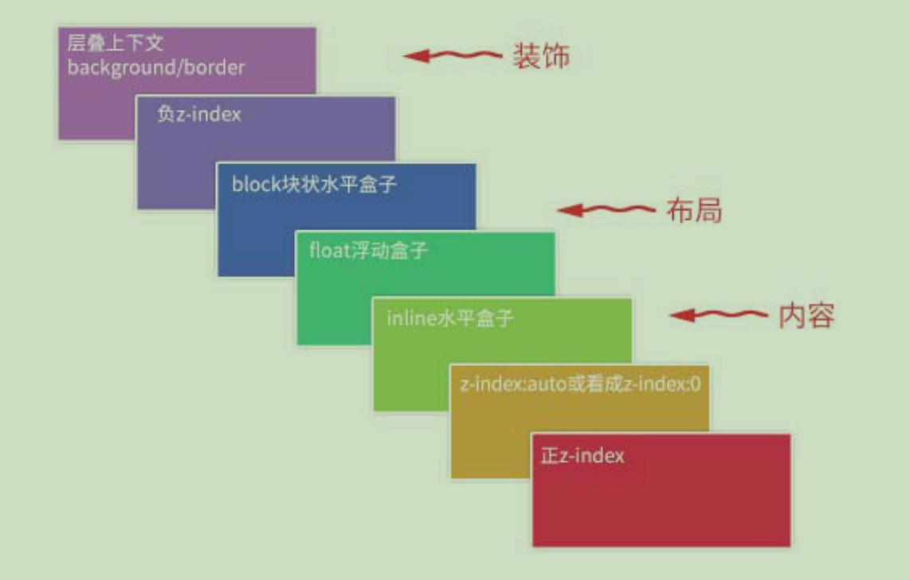

## 透明度
使用 opacity 属性为元素的背景添加透明度时，其所有子元素都继承相同的透明度。这可能会使完全透明的元素内的文本难以阅读

如果您不希望对子元素应用不透明度，例如上面的例子，请使用 RGBA 颜色值。

<!--more-->
## 选择器
```css
p.center {
  ...
}
```
表示选择class为center的p元素

## 边框
除非设置了 border-style 属性，否则其他 CSS 边框属性都不会有任何作用！

## 外边距合并
外边距合并指的是，当两个垂直外边距相遇时，它们将形成一个外边距。合并后的外边距的高度等于两个发生合并的外边距的高度中的较大者
- 当一个元素出现在另一个元素上面时，第一个元素的下外边距与第二个元素的上外边距会发生合并
- 当一个元素包含在另一个元素中时（假设没有内边距或边框把外边距分隔开），它们的上和/或下外边距也会发生合并
- 当一个空元素，它有外边距，但是没有边框或填充。在这种情况下，上外边距与下外边距就碰到了一起，它们也会发生合并
> 只有普通文档流中块框的垂直外边距才会发生外边距合并。行内框、浮动框或绝对定位之间的外边距不会合并

# css的层叠规则
css世界层叠顺序规则

> 元素一旦成为定位元素，其z-index就会自动生效，此时其z-index就是默认的auto，也就是0。所以定位元素会层叠在普通元素的上面。
> 不支持z-index的层叠上下文元素天然就是z-index：auto级别

层叠上下文的创建
1. 天生派：页面html根元素
2. 正统派：z-index值为**数值**的定位元素
3. 扩招派：其他css3属性

层叠黄金准则
1. **谁大谁上**：当具有明显的层叠水平标识时，如生效的z-index属性值，在同一个层叠上下文领域，层叠水平值大的那个覆盖小的那个
2. **后来居上**：当元素层叠水平一致，层叠顺序相同的时候，在DOM流中处于后面的元素会覆盖前面的元素

# width宽度
width：auto元素如水流，width设置成固定值元素如砖块，水流会有更好的容错性。

宽度分离原则：css中的width属性不与影响宽度的padding/border/margin属性共存。
> 在前端领域，一提到分离，作用一定是便于维护

上述的宽度分离原则的使用，需要在外层套一层父标签。不想嵌套html标签的话，可以使用box-sizing属性，来改变width的作用细节。

但是只有当元素没有水平margin时，box-sizing才能真正无计算。而「宽度分离」原则可以彻底解决所有宽度计算问题

浏览器渲染的基本原理：先下载文档内容，加载头部的样式资源，然后按照从上到下、由外而内的顺序渲染dom内容