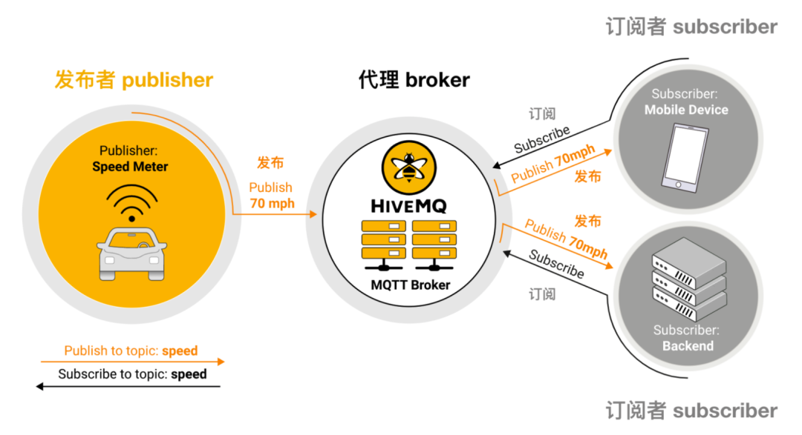
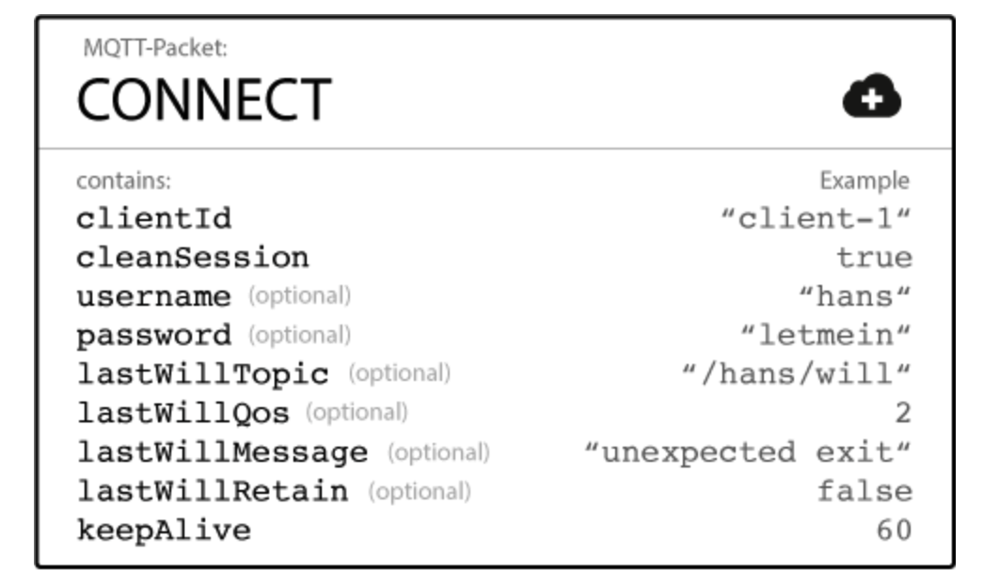
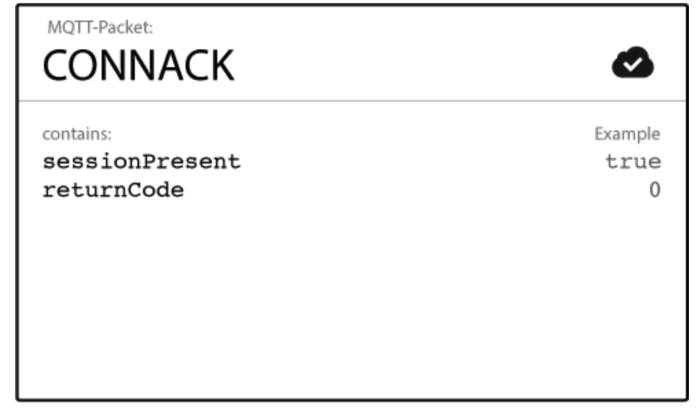
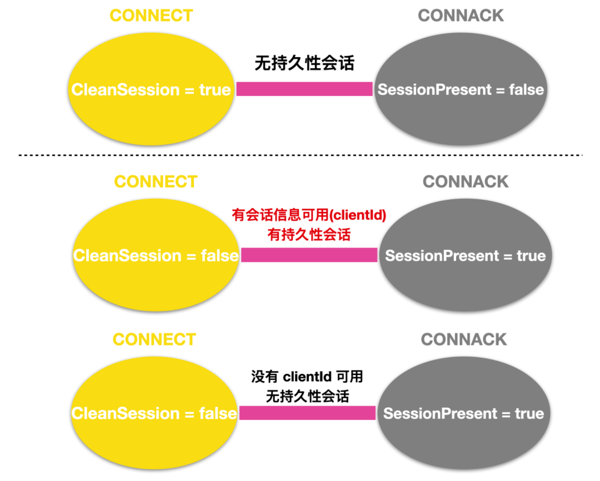
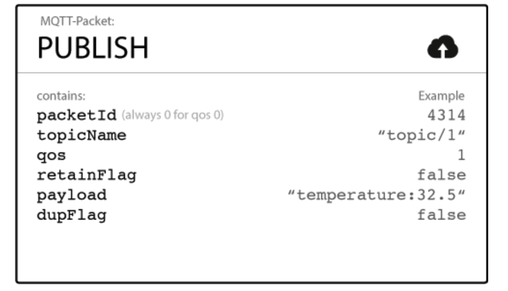
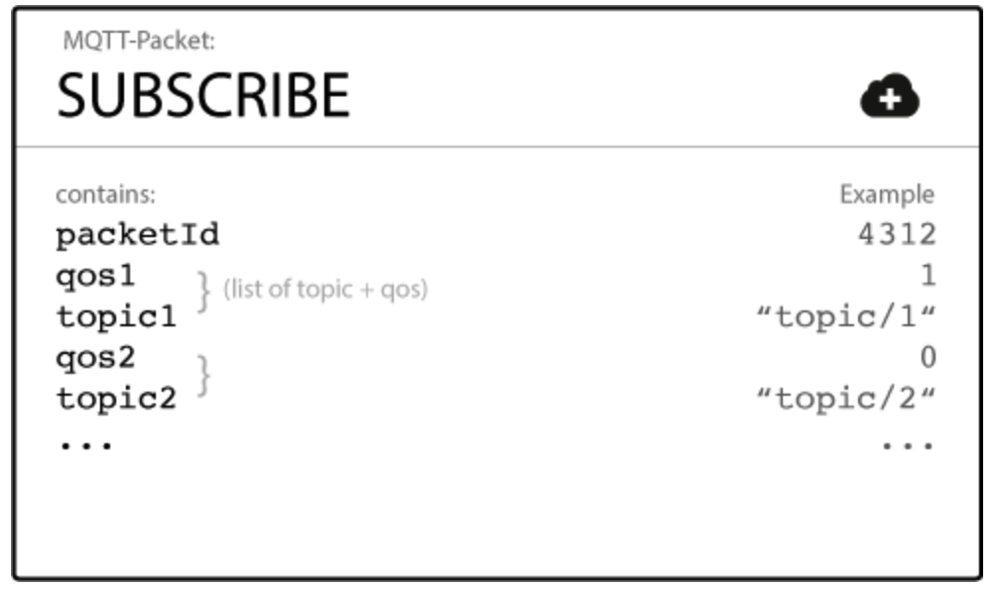
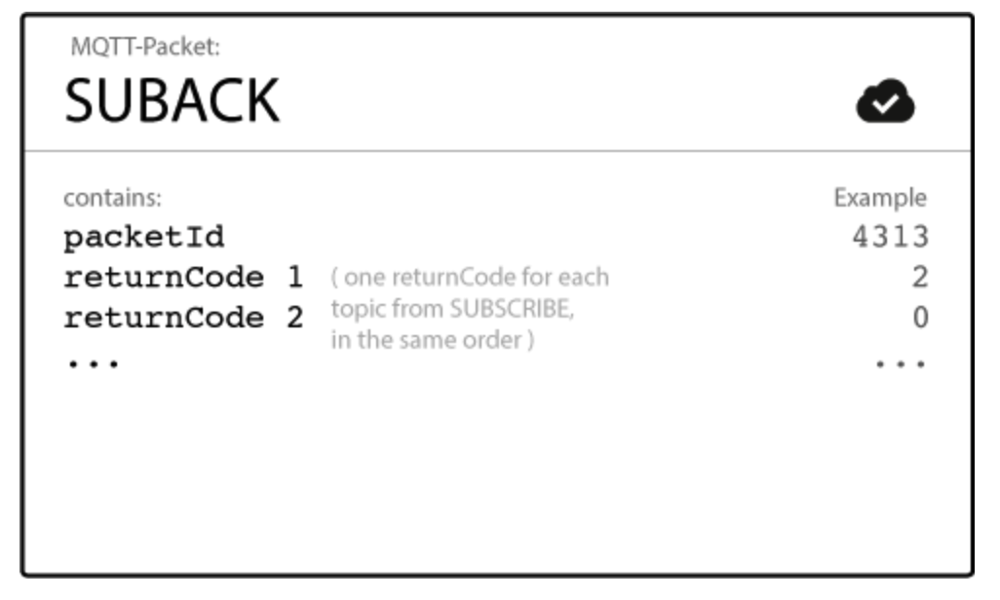
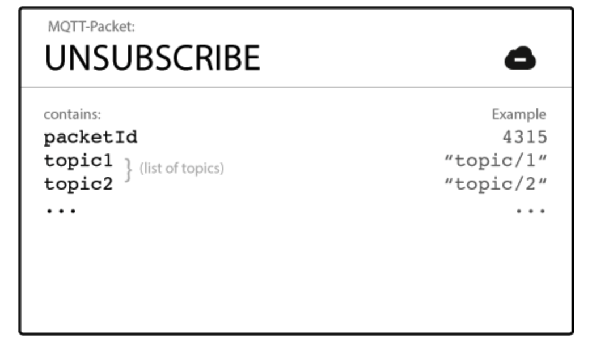

## **什么是MQTT**
MQTT 协议的全称是 **Message Queuing Telemetry Transport**，翻译为消息队列传输探测，它是 ISO 标准下的一种基于**发布 - 订阅**模式的消息协议，它是基于 TCP/IP 协议簇的，它是为了改善网络设备硬件的性能和网络的性能来设计的。MQTT 一般多用于 IoT 即物联网上，广泛应用于工业级别的应用场景，比如汽车、制造、石油、天然气等。

<!--more-->
## **MQTT基础**
MQTT 协议总结一点就是一种**轻量级的二进制协议**，MQTT 协议与 HTTP 相比具有一个明显的优势：**数据包开销较小**，数据包开销小就意味着更容易进行网络传输。

还有一个优势就是 MQTT 在客户端容易实现，而且具有易用性，非常适合当今资源有限的设备。

- 协议必须易于实现；
- 协议中的数据必须易于传输，消耗成本小；
- 协议必须提供服务质量管理；
- 协议必须支持连续的会话控制
- 假设数据不可知，不强求传输数据的类型与格式，保持灵活性。

### **发布-订阅模式**
发布 - 订阅模式我相信接触消息中间件架构的同学都听过，这是一种传统的**客户端 - 服务器**架构的替代方案，因为一般传统的客户端-服务器是客户端能够直接和服务器进行通信。

但是发布 - 订阅模式 `pub/sub`就不一样了，发布订阅模式会将发送消息的发布者 `publisher`与接收消息的订阅者 `subscribers`进行分离，`publisher` 与 `subscribers` 并不会直接通信，他们甚至都不清楚对方是否存在，他们之间的交流由第三方组件`broker`代理。

pub/sub 最重要的方面是 publisher 与 subscriber 的解藕，这种耦合度有下面三个维度：

- **空间解耦**：publisher 与 subscriber 并不知道对方的存在，例如不会有 IP 地址和端口的交互，也更不会有消息的交互。

- **时间解藕**：publisher 与 subscriber 并不一定需要同时运行。

- **同步 `Synchronization` 解藕**：两个组件的操作比如 publish 和 subscribe 都不会在发布或者接收过程中产生中断。

总之，发布/订阅模式消除了传统客户-服务器之间的直接通信，把通信这个操作交给了 broker 进行代理，并在空间、时间、同步三个维度上进行了解藕。

### **消息过滤**
在 pub/sub 的架构模式中，broker 扮演着至关重要的作用，其中非常重要的一点就是 broker 能够对消息进行过滤，使每个订阅者只接收自己感兴趣的消息。

- **基于主题的过滤**
MQTT 是基于 subject 的消息过滤的，每条消息都会有一个 topic ，接收客户端会向 borker 订阅感兴趣的 topic，订阅后，broker 就会确保客户端收到发布到 topic 中的消息。

- **基于内容的过滤**
在基于内容的过滤中，broker 会根据特定的内容过滤消息，接受客户端会经过过滤他们感兴趣的内容。这种方法的一个显著的缺点就是必须事先知道消息的内容，不能加密或者轻易修改。

- **基于类型的过滤**
在使用面向对象的语言时，基于消息（事件）的类型过滤是一种比较常见的过滤方式。

## **MQTT与消息队列的区别**
MQTT 是一种消息队列传输探测协议，这种协议是看似是以消息队列为基础，但却与消息队列有所差别。

在传统的消息队列模式中，一条消息会存储在消息队列中等待被消费，每个传入的消息都存储在消息队列中，直到它被客户端（通常称之为消费者）所接收，如果没有客户端消费消息的话，这条消息就会存在消息队列中等待被消费。但是在消息队列中，不会存在消息没有客户端消费的情况，但是在 MQTT 中，确存在 topic 无 subscriber 订阅的情况。

在传统的消息队列模式中，一条消息只能被一个客户端所消费，负载会分布在队列的每个消费者之间；而在 MQTT 中，每个订阅者都会受到消息，每个订阅者有相同的负载。

在传统的消息队列模式中，必须使用单独的命令来显式创建队列，只有队列创建后，才可以生产或者消费消息；而在 MQTT 中，topic 比较灵活，可以即时创建。

## **MQTT重要概念**
### **MQTT client**
当我们讨论关于客户端的概念时，一般指的就是 MQTT Client，publisher 和 subscriber 都属于 MQTT Client。之所以有发布者和订阅者这个概念，其实是一种相对的概念，就是指当前客户端是在发布消息还是在接收消息，发布和订阅的功能也可以由同一个 MQTT Client 实现。

MQTT 客户端是指运行 MQTT 库并通过网络连接到 MQTT broker 的任何设备，这些设备可以从微控制器到成熟的服务器。基本上，任何使用 TCP/IP 协议使用 MQTT 设备的都可以称之为 MQTT Client。MQTT 协议的客户端实现非常简单直接。易于实施是 MQTT 非常适合小型设备的原因之一。MQTT 客户端库可用于多种编程语言。例如，Android、Arduino、C、C++、C#、Go、iOS、Java、JavaScript 和 .NET。

### **MQTT broker**
与 MQTT client 对应的就是 MQTT broker，broker 是任何发布/订阅机构的核心，根据实现的不同，代理可以处理多达数百万连接的 MQTT client。

broker 负责接收所有消息，过滤消息，确定是哪个 client 订阅了每条消息，并将消息发送给对应的 client，broker 还负责保存会话数据，这些数据包括订阅的和错过的消息。broker 还负责客户端的身份验证和授权。

### **MQTT Connection**
MQTT 是基于 TCP/IP 协议基础之上的，所以 MQTT 的 client 和 broker 都需要 TCP/IP 协议的支持。

MQTT 的连接总是在 client 和 broker 之间进行，client 和 client 之间并不会相互连接。如果要发起连接的话，那么 client 就会向 broker 发起 `CONNECT` 消息，代理会使用 `CONNACK` 消息和状态码进行响应。一旦 client 和 broker 的连接建立后，broker 就会使客户端的连接一直处于打开状态，直到 client 发出断开命令或者连接中断。

## **消息报文**
MQTT 的消息报文主要分为 CONNECT 和 CONNACK 消息。

### **CONNECT**
我们上面提到了为了初始化连接，需要 client 向 broker 发送 CONNECT 消息，如果这个 CONNECT 消息格式错误或者打开套接字（因为基于 TCP/IP 协议栈需要初始化 Socket 连接）时间过长，亦或是发送连接消息时间过长的话，broker 就会关闭这条连接。

一个 MQTT 客户端发送一条 CONNECT 连接，这条 CONNECT 连接可能会包含下面这些信息：

- `ClientId`：显而易见，这个就是每个客户端的 ID 标识，也就是连接到 MQTT broker 的每个 client。这个 ID 应该是每个 client 和 broker 唯一的，如果你不需要 broker 持有状态的话，你可以发送一个空的 ClientId，空的 ClientId 会没有任何状态。在这种情况下，`ClientSession` 需要设置为 true，否则将会拒绝连接。

- `clientSession` 是什么我们下面会说。

- `CleanSession`：CleanSession 会话标志会告诉 broker client 是否需要建立持久会话。在持久会话 （CleanSession = false）中，broker 存储 client 的所有订阅以及**服务质量(Qos)** 是 1 或 2 订阅的 client 的所有丢失的消息。如果会话不是持久的（CleanSession = true），那么 broker 则不会为 client 存储任何内容并且会清除先前持久会话中的所有信息。

- `Username/Password` ：MQTT 会发送 username 和 password 进行 client 认证和授权。如果此信息没有经过加密或者 hash ，那么密码将会以纯文本的形式发送。所以，一般强烈建议 username 和 password 要经过加密安全传输。像 HiveMQ 这样的 broker 可以与 SSL 证书进行身份验证，因此不需要用户名和密码。

- `LastWillxxx` ：LastWillxxx 表示的是遗愿，client 在连接 broker 的时候将会设立一个遗愿，这个遗愿会保存在 broker 中，当 client 因为**非正常原因**断开与 broker 的连接时，broker 会将遗愿发送给订阅了这个 topic（订阅遗愿的 topic）的 client。

- `keepAlive`：keepAlive 是 client 在连接建立时与 broker 通信的时间间隔，通常以秒为单位。这个时间指的是 client 与 broker 在不发送消息下所能承受的最大时长。

### **CONNACK**
当 broker 收到 CONNECT 消息时，它有义务回复 CONNACK 消息进行响应。CONNACK 消息包括两部分内容

- `SessionPresent`：会话当前标识，这个标志会告诉 client 当前 broker 是否有一个持久性会话与 client 进行交互。SessionPresent 标志和 CleanSession 标志有关，当 client 在 CleanSession 设置为 true 的情况下连接时，SessionPresent 始终为 false，因为没有持久性会话可以使用。如果 CleanSession 设置为 false，则有两种可能性，如果 ClientId 的会话信息可用，并且 broker 已经存储了会话信息，那么 SessionPresent 为 true，否则如果没有 ClientId 的任何会话信息，那么 SessionPresent 为 false。

- `ReturnCode`：CONNACK 消息中的第二个标志是连接确认标志。这个标志包含一个返回码，告诉客户端连接尝试是否成功。连接确认标志有下面这些选项。
| 返回码 | 返回码含义 |
| :----- | :--- |
| 0 |  已接受连接 |
| 1 |  连接被拒绝，不可接受的协议版本 |
| 2 |  连接被拒绝，标识符被拒绝 |
| 3 |  连接被拒绝，服务器不可用 |
| 4 |  连接被拒绝，用户名或密码错误 |
| 5 |  连接被拒绝，未授权 |

## **消息类型**
### **发布**
当 MQTT client 在连接到 broker 之后就可以发送消息了，MQTT 使用的是基于 topic 主题的过滤。每条消息都应该包含一个 topic ，broker 可以使用 topic 将消息发送给感兴趣的 client。除此之外，每条消息还会包含一个**负载(Payload)**，Payload 中包含要以字节形式发送的数据。

MQTT 是数据无关性的，也就是说数据是由发布者 - publisher 决定要发送的是 XML 、JSON 还是二进制数据、文本数据。

MQTT 中的 PUBLISH 消息结构如下。

- `Packet Identifier`：这个 PacketId 标识在 client 和 broker 之间唯一的消息标识。packetId 仅与大于零的 Qos 级别相关。

- `TopicName`：主题名称是一个简单的字符串，`/` 代表着分层结构。

- `Qos`：这个数字表示的是服务质量水平，服务质量水平有三个等级：0、1 和 2，服务级别决定了消息到达 client 或者 broker 的保证类型，来决定消息是否丢失。

- `RetainFlag`：这个标志表示 broker 将最近收到的一条 RETAIN 标志位为`true`的消息保存在服务器端（内存或者文件）。

> MQTT 服务器只会为每一个 Topic 保存最近收到的一条 RETAIN 标志位为`true`的消息。也就是说，如果MQTT 服务器上已经为某个 Topic 保存了一条 Retained 消息，当客户端再次发布一条新的 Retained 消息时，那么服务器上原来的那条消息会被覆盖。

- `Payload`：这个是每条消息的实际内容。MQTT 是数据无关性的。可以发送任何文本、图像、加密数据以及二进制数据。

- `Dupflag`：这个标志表示该消息是重复的并且由于预期的 client 或者 broker 没有确认所以重新发送了一次。这个标志仅仅与 Qos 大于 0 相关。

当 client 向 broker 发送消息时，broker 会读取消息，根据 Qos 的级别进行消息确认，然后处理消息。处理消息其实就是确定哪些 subscriber 订阅了 topic 并将消息发送给他们。

### **订阅**
client 会向 broker 发送 SUBSCRIBE 消息来接收有关感兴趣的 topic，这个 SUBSCRIBE 消息非常简单，它包含了一个唯一的数据包标识和一个订阅列表。

- `Packet Identifier`：这个 PacketId 和上面的 PacketId 一样，都表示消息的唯一标识符。

- `ListOfSubscriptions`：SUBSCRIBE 消息可以包含一个 client 的多个订阅，每个订阅都会由一个 topic 和一个 Qos 构成。订阅消息中的 topic 可以包含通配符。

### **确认消息**
client 在向 broker 发送 SUBSCRIBE 消息后，为了确认每个订阅，broker 会向 client 发送 SUBACK 确认消息。这个 SUBACK 包含原始 SUBSCRIBE 消息的 packetId 和返回码列表。

- `Packet Identifier` ：这个数据包标识符和 SUBSCRIBE 中的相同。

- `ReturnCode：broker` 为每个接收到的 SUBSCRIBE 消息的 topic/Qos 对发送一个返回码。例如，如果 SUBSCRIBE 消息有五个订阅消息，则 SUBACK 消息包含五个返回码作为响应。

### **退订和确认退订**
SUBSCRIBE 消息对应的是 `UNSUBSCRIBE` 消息，这条消息发送后，broker 会删除关于 client 的订阅。所以，UNSUBSCRIBE 消息与 SUBSCRIBE 消息类似，都具有 packetId 和 topic 列表。

取消订阅也需要 broker 的确认，此时 broker 会向 client 发送一个 `UNSUBACK` 消息，这个 UNSUBACK 消息非常简单，只有一个 packetId 数据标识符。

## **聊聊 Topic**
聊了这么多关于 MQTT 的内容，但是我们还没有好好聊过 Topic。在 MQTT 中，Topic 是指 broker 为每个连接的 client 过滤消息的 `UTF-8` 字符串。Topic 是一种分层的结构，可以由一个或者多个 Topic 组成。每个 Topic 由 `/`进行分割。

与传统的消息队列相比，MQTT Topic 非常轻量级，client 在发布或订阅之前不需要先创建所需要的 Topic，broker 在接收每个 Topic 前不用进行初始化操作。

当客户端订阅 Topic 时，它可以订阅已发布消息的确切 Topic，也可以使用**通配符**来同时订阅多个 Topic。通配符有两种：**单级和多级**。

### **单级通配符**
单级通配符可以替换 Topic 的一个级别，`+` 号代表 Topic 中的单级通配符。

### **多级通配符**
多级通配符涵盖多个 Topic，`#` 代表 Topic 中的多级通配符。为了让 broker 能够确定和哪些 Topic 匹配，多级通配符必须作为 Topic 中的最后一个字符放置，并以 `/` 开头。

当 client 订阅带有多级通配符的 Topic 时，不论 Topic 有多长多深，它都会收到通配符之前 Topic 的所有消息。如果你只将 Topic 定义为 # 的话，那么你将会收到所有的消息。
