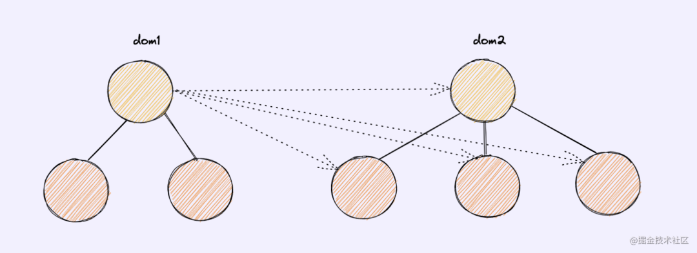
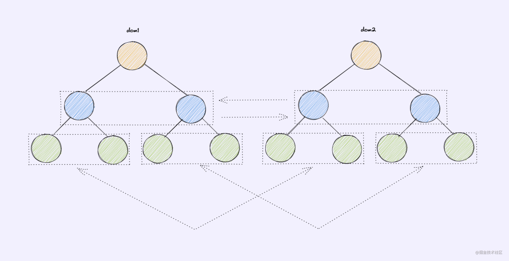

## **虚拟DOM**
### **什么是虚拟DOM**
**虚拟DOM就是一个用来描述真实DOM的javaScript对象**
<!--more-->
真实DOM:
``` xml
<ul class="list">
    <li>a</li>
    <li>b</li>
    <li>c</li>
</ul>
```

虚拟DOM:
``` javascript
let vnode = h('ul.list', [
  h('li','a'),
  h('li','b'),
  h('li','c'),
])
```

### **为什么需要虚拟DOM**
1. MVVM框架解决视图和状态同步问题
2. 模板引擎可以简化视图操作,没办法跟踪状态
3. 虚拟DOM跟踪状态变化
4. 参考github上virtual-dom[1]的动机描述
   1. 虚拟DOM可以维护程序的状态,跟踪上一次的状态
   2. 通过比较前后两次状态差异更新真实DOM
5. 跨平台使用
   1. 浏览器平台渲染DOM
   2. 服务端渲染SSR(Nuxt.js/Next.js),前端是vue向,后者是react向
   3. 原生应用(Weex/React Native)
   4. 小程序(mpvue/uni-app)等
6. 真实DOM的属性很多，创建DOM节点开销很大
7. 虚拟DOM只是普通JavaScript对象，描述属性并不需要很多，创建开销很小
8. 复杂视图情况下提升渲染性能(操作dom性能消耗大,减少操作dom的范围可以提升性能)，简单视图情况下，不一定比直接重新渲染更快

## **diff算法**
diff算法其实就是找出修改前后虚拟DOM树的差异

Diff 的对象是虚拟DOM（virtual dom），更新真实 DOM 是 Diff 算法的结果。

**传统diff算法**
1. 传统算法查找两颗树每一个节点的差异
2. 会运行n1(dom1的节点数)*n2(dom2的节点数)次方去对比,找到差异的部分再去更新


**diff算法优化**
1. DOM操作时候很少会跨级别操作节点
2. 只比较同级别的节点


### diff算法中key的作用
1. Diff操作可以更加快速;（实例:a,b,c三个dom元素中的b,c间插入一个z元素）
2. Diff操作可以更加准确，避免渲染错误（实例:a,b,c三个dom元素,修改了a元素的某个属性再去在a元素前新增一个z元素）
3. 不推荐使用索引作为key