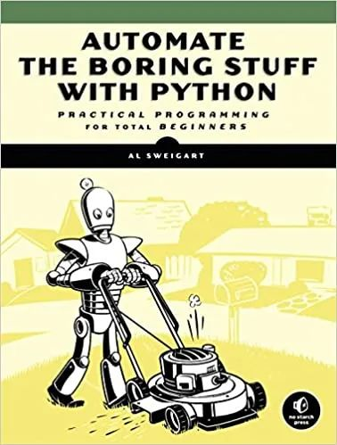
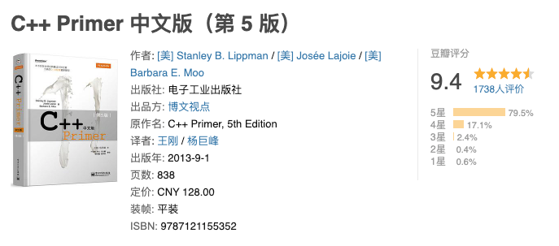
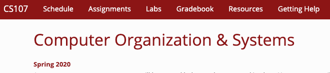
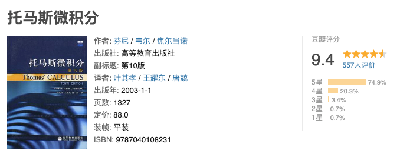
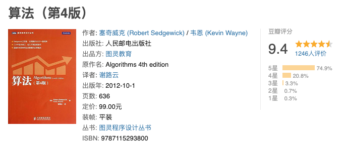
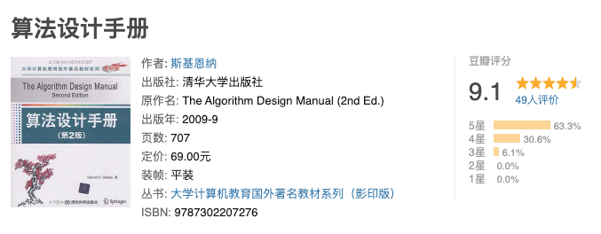
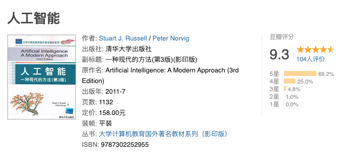
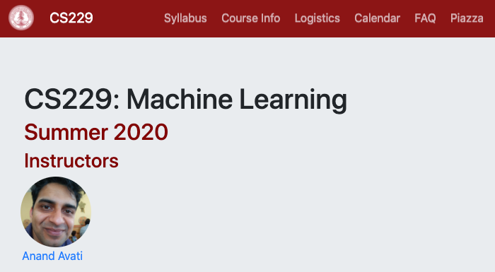
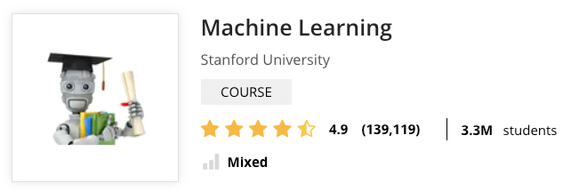
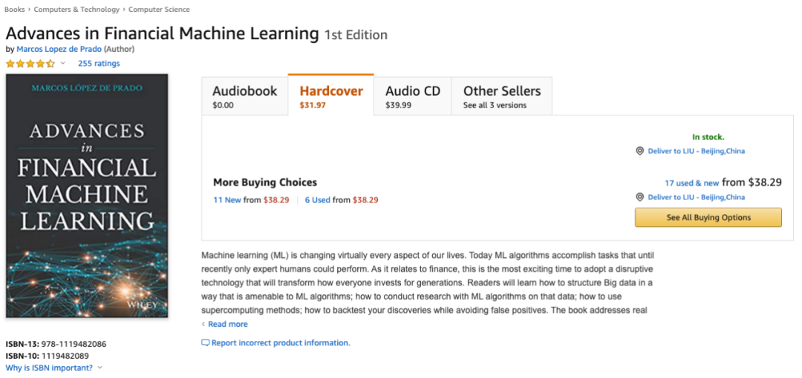

> 迄今为止看到的最完备最有逻辑性的人工智能学习路线
> 

很多同学都问过我，如果对人工智能感兴趣，都应该学什么？学习的路径或者顺序是怎样的？

在这篇文章中，我将结合大量的书籍或者公开课信息（以斯坦福大学的公开课为主），聊一聊：如果系统地学习人工智能，都需要接触什么课程。

为了让内容整体更有体系，我将所有的内容分成四个阶段。每个阶段可以简单理解成对应大学的一个学年。也就是如果大家假想自己现在高中毕业的话，**根据这篇文章提供的“学习地图”，使用四年的时间，就可以在人工智能的深度和广度上都有相当地理解和掌握了。**

对，你没有看错，是四年的时间。相当于读一个本科的时间。

<!--more-->
所以，这不是一份广告。因为所有培训广告只会告诉你四个月就够；但**所有人都明白四个月是不够的。**如果四个月就可以掌握人工智能，人工智能也太简单了，它也就不值钱了。

当然，由于每个人基础不同，所以对于这份比较全面的学习路径，有些同学可能已经掌握了相当的内容，那么就可以跳过一些内容，加快速度了。

以下为正文内容：

# 第一年：语言基础 + 数学
首先，人工智能作为计算机科学的一个分支，是需要编程的。想要编程，大家必须学习计算机语言基础。

## 1.Python
对于计算机语言的选择，首先，毋庸置疑，需要学习 Python 语言。关于 Python 语言语法基础的学习，我就不推荐资源了。网上收费的免费的各种资源太多了。

另外，在掌握了 Python 基础语法以后，对于 Python 的应用，我在我的 开源分享第三期 中分享的第一个资源，非常值得看一看。现在在网上完全可以免费查看。

这本书也有中文版，叫这个名字：《Python编程快速上手 让繁琐工作自动化（Python3编程从入门到实践 新手学习用书）》

## 2.C++
除了 Python，我还推荐学习一门编译型语言。对于这个语言的选择，于人工智能方向而言，我个人推荐 C++。因为真正的人工智能工程师，深入到底层，是需要大量使用 C/C++ 的。而 Python 更多的是一种“前端”工具，提供接口调用而已。

对于 C++ 的学习，去看 《C++ Primer》就好了。如果有 Python 基础，看这本书应该没有什么难度。当然，C++ 深入进去可以很复杂。但是在这个阶段，一本《C++ Primer》足以。

## 3.程序运行底层 & C
下面，我要推荐一门斯坦福大学的基础课，CS107：Computer Organization & Systems。如果翻译过来的话，就是计算机的组织和系统。

这门课程听起来很深奥，但其实是一个不折不扣的基础课程。这门课程使用的语言是 C 语言。但是学习的关键完全不是 C 语言的语法知识。事实上，如果大家已经学习了 C++，掌握 C 语言的语法是很容易的。

这门课程的核心是借助 C 语言，了解计算机程序运行的一些低层级制。比如位运算；比如指针；比如内存管理；比如内存中的栈和堆之间的区别；比如类型机制乃至泛型的底层实现；包括一些底层优化等等内容。另外，这门课程也会包含一些汇编基础。

传送门：

https://web.stanford.edu/class/archive/cs/cs107/cs107.1206/index.html

## 4.微积分
除了语言基础，另外一个学习人工智能需要打好的基础，就是数学。

整体，人工智能需要学习的数学基础，和一般工科需要学习的数学没有什么太大的区别：微积分，线性代数和概率论。

对于微积分，最流行的课本应该就是《托马斯微积分》。

## 5.线性代数
对于线性代数，市面上的好教材太多。我在我的文章 学习乘法不能帮助我们理解质能方程 和 开源分享第九期 两篇文章中，总共分享了三个线性代数课本。

Gilbert Strang 老爷子在 MIT 的线数公开课很有名，相信很多同学都看过。如果没看过的话，推荐看一下。

一本叫《Introduction to Linear Algebra》，最新版是第五版。有中文版，就叫《线性代数》。作者是 MIT 大名鼎鼎的 Gilbert Strang。

MIT 的官方地址在这里：https://ocw.mit.edu/courses/mathematics/18-06-linear-algebra-spring-2010/index.htm；

2020 年更新的视频内容在这里：https://ocw.mit.edu/resources/res-18-010-a-2020-vision-of-linear-algebra-spring-2020/videos/

## 6. 概率论（和数理统计）
对于概率论，我推荐斯坦福的 CS109：Probability for Computer Scientists。

这门课程翻译过来就叫《为计算机科学家准备的概率论》，所以对于计算机专业来说，学起来更有针对性。

另外，学习这门课程的过程中，也就会接触一些机器学习方面的基本概念了 

传送门：http://web.stanford.edu/class/cs109/

# 第二年：计算机基础
如果想成为一名人工智能工程师，计算机领域的基础必须打好。但与此同时，我认为专注于人工智能方向，一些特别低层的内容，比如组成原理，或者数字逻辑，甚至是编译原理等等，并不需要专门学习。所以下面的内容，并不包含这些内容。

下面是我认为人工智能方向应该重视的计算机基础知识，应该在第二年掌握。

## 1. 算法和数据结构
算法和数据结构的重要性不想多说了。就算你不理解他们实际上有什么用，只要明白，想当工程师，面试必考算法和数据结构就好了。

当然，如果你认真学习这篇文章推荐的后续课程内容，近乎一定会体会到算法和数据结构的巨大意义。

关于资源，推荐两个，都是书籍。

首先，就是大名鼎鼎的《算法4》。

《算法4》其实也有不少缺点，找时间我专门写文章聊一聊。但是在这篇文章，大家可以注意两点。

第一点，《算法4》的代码是基于 Java 语言的。所以，大家可以再借此接触一下 Java 语言，没坏处的。而且如果大家已经有了 C++ 基础，上手 Java 是很快的。

第二点，就是《算法4》偏经典的算法和数据结构的底层实现，而在算法设计方面介绍得很少。所以，就有了我推荐的第二个资源：《算法设计手册》。

这本书更偏向算法设计，我认为和《算法4》能形成一个很好的互补。

值得一提的是，这本书的英文原版正版，现在在国外是免费下载的。

传送门：https://link.springer.com/book/10.1007/978-1-84800-070-4

## 2. 操作系统基础

操作系统也属于计算机专业的必修课程。这不仅仅是因为我们需要了解操作系统的很多底层机制，更重要的是，我们可以借此学习很多系统设计（System Design）方面的理念。

要知道，一个人工智能应用，也是一个系统。在系统设计开发层面，很多东西是共通的。

操作系统方面也有很多经典教材。不过在这里，我推荐斯坦福的课程 CS140：Operating Systems。

传送门：http://web.stanford.edu/~ouster/cgi-bin/cs140-spring20/index.php

## 3. 数据库基础

做人工智能需要处理大量的数据，这就需要使用数据库，了解数据库的基础。同时，这本质也是在学习“数据模型”这个概念，了解数据存储的设计方案。

数据库方面的经典教材也不要太多。在这篇文章，我推荐斯坦福大学的课程 CS145：Data Management and Data Systems。

传送门：https://cs145-fa19.github.io/

## 4. 并行计算基础
我上学的年代，并行计算还不是计算机专业必学的内容。但现在，并行计算已经无处不在了。时代发展太快了，计算机专业的同学已经必学并行计算了。

在这篇文章中，我推荐斯坦福大学的课程 CS149：PARALLEL COMPUTING

传送门：http://cs149.stanford.edu/fall19/

## 5. 人工智能基础
作为一个人工智能专业的学习路径，终于出现人工智能啦！

在这里，我首先推荐大家整体性地了解人工智能这个领域。

什么叫整体地了解？因为现在说到人工智能，很多同学就会直接想到机器学习或者深度学习。但其实，**机器学习和深度学习只是人工智能的一个子领域而已。**

与此同时，有很多同学都问过我，想了解诸如 A* 算法，遗传算法，模拟退火，蚁群算法等等这类的算法，应该看什么？其实，这类算法都是人工智能算法，只不过在现阶段，相比机器学习的算法，这些算法的成绩不够“耀眼”。

但是，如果深入了解人工智能，我认为这些算法也是需要学习的。要知道，神经网络其实在十几年前，也是人工智能领域不够“耀眼”的思想之一，静静地躺在角落里，直到最近有了巨大的突破，风靡于世。谁知道再过十年，哪种思想会突然有所突破，爆发起来呢？

关于整体性地了解人工智能，最经典的教材，就是这本了：

但是，这本书是一个大部头，细细啃一遍太花时间了。我建议配合一个视频课程看。比如，斯坦福大学的 CS221: Artificial Intelligence: Principles and Techniques

传送门：https://stanford-cs221.github.io/spring2020/

或者，EdX 上有一门课程，我学过，是以这本书为纲的，我觉得挺不错的。可以免费试听。

传送门：https://www.edx.org/course/artificial-intelligence-ai

# 第三年：机器学习
现在，是时候深入学习当下人工智能领域最主流的方法：机器学习和深度学习了。

## 1. 机器学习
机器学习领域最著名的课程，就是斯坦福大学的 CS229 了。Andrew Ng 在 Coursera 上大名鼎鼎的《机器学习》课程，就是这门 CS 229 的简化。

斯坦福大学的 CS 229，比 Coursera 上的课程更加深入，内容也更丰富。不过现在，已经不是 Andrew Ng 讲了。

传送门：http://cs229.stanford.edu/

当然，说到了 Andrew Ng，就要说说他在 Coursera 上的一系列课程，在这个阶段都可以看一看。

最著名的当属 Machine Learning。这名课程的 logo 使用的这个小机器人，都快成机器学习领域的吉祥物了。

传送门：https://www.coursera.org/learn/machine-learning?

Andrew Ng 后来创办了 deeplearning.ai 后，在 Coursera 上开设了一个深度学习的系列课程，也值得学习。 

传送门：https://www.coursera.org/specializations/deep-learning

## 2. 凸优化
学习了机器学习，大家就会知道，大多数机器学习方法都是要对一个最优函数做优化。其中就需要的一个相对比较专门的数学基础：凸优化。

关于凸优化，斯坦福大学的 CS364a 是这方面的入门课程。另外，课程中也推荐了一本教材。

传送门：http://web.stanford.edu/class/ee364a/

## 3. 概率图模型
概率图模型也是深入理解很多人工智能方法的利器，在图像识别，自然语言处理领域都有非常多的应用。我研究生时期的毕业课题，是做虚拟动作识别，也需要使用概率图模型。

关于概率图模型，斯坦福大学有一门非常经典的课程 CS 228: Probabilistic Graphical Models

传送门：https://cs.stanford.edu/~ermon/cs228/index.html

在 Coursera 上也有一个概率图模型的系列课程，是斯坦福的这门课程的简化版本。

传送门：https://www.coursera.org/specializations/probabilistic-graphical-models

## 4. 数据挖掘
数据挖掘主要是对大规模数据进行处理的。在数据的聚类分析，大规模的监督学习，包括推荐系统等领域，都有广泛应用。

对于数据挖掘，推荐斯坦福大学的 CS246: Mining Massive Data Sets。

传送门：http://web.stanford.edu/class/cs246/

# 第四年：专有领域学习
机器学习方法是领域相关的。在不同的领域，有很多专有的方法，包括专门的研究对象，需要进一步学习。

学到这里，相信大家已经有了相当的基础，可以挑选自己喜欢的方向，去做专门的学习了。

## 1. 卷积神经网络和计算机视觉
计算机视觉近乎是现在人工智能被应用最广泛的领域了，从人脸识别到 OCR，从无人驾驶到各种工业机器人的智能系统。

对于人工智能在视觉领域的应用，最著名的课程，应该就是华人科学家李飞飞在斯坦福大学的课程了。CS231n Convolutional Neural Networks for Visual Recognition。

传送门：http://cs231n.stanford.edu/

## 2. 自然语言处理
当下人工智能另外一个应用非常广泛的应用领域，就是自然语言处理了。

这方面的经典课程，我推荐斯坦福大学的 CS224n: Natural Language Processing with Deep Learning。

传送门：http://web.stanford.edu/class/cs224n/

## 3. 机器学习在金融领域的应用
人工智能在金融领域的应用也是一个重要的趋势。但是通常，在计算机专业中，不是被特别强调。毕竟大多数计算机专业的学生还是要去 IT 大厂，而不是华尔街。

但是因为有很多同学对人工智能在金融领域的应用感兴趣，在这里也提一句。我在我的 开源分享第一期，就分享了一本书，是公认的机器学习在金融领域应用的宝典。感兴趣的同学可以参考：

美国亚马逊链接：https://www.amazon.com/Advances-Financial-Machine-Learning-Marcos/dp/1119482089/

## 4. 机器学习在生物医学医药领域的应用
同样，机器学习在医学医药领域也有了越来越多的应用。只不过通常计算机专业的同学不很了解这方面。而是相反的，很多医学医药领域的人，会来学习人工智能的知识，进而应用在自己的领域，这种情况更多一些。

关于生物医学医药领域，整体我还是很看好的。虽然不知道爆炸的时间是什么时候，但我相信有着光明的未来。

而且，这个领域和计算机专业有着越来越多的交集，我之前在公众号还写过一篇文章：算法不好的工程师不是优秀的生物学家。

在这方面，Andrew Ng 的 deeplearning.ai 在 Coursera 上也开设了一个系列课程，叫 Ai for Medicine，感兴趣的同学可以去了解一下。

传送门：https://www.coursera.org/specializations/ai-for-medicine

## 5. Kaggle
当然了，学习到这里，大家已经可以（其实早就可以了）去参加 Kaggle 的竞赛了。在 Kaggle 上，会有大量真实的数据供大家实验，让大家尝试解决“真实的问题”。虽然在这类平台上竞技，其实和解决真实的问题还是有差距，但也比使用虚拟的数据，或者仅仅是学习原理，强太多。

同时，Kaggle 也绝不仅仅只是一个竞赛平台，更是一个非常好的学习平台，或者说是机器学习相关的垂直交流平台。Kaggle 上大部分任务都有相当多的公开的 notebook，供大家交流学习。仔细研究的话，相信每个人都能从中受到很多启发。

当然了，如果此时，大家有机会，能到真正的业界去参与真实的项目，那就更赞了。

好啦。如果你真的想认真学习人工智能，相信这篇文章，为你提供了一个很好的路线。

所有的资源都在这里了，就差投入时间精力好好学习了 图片