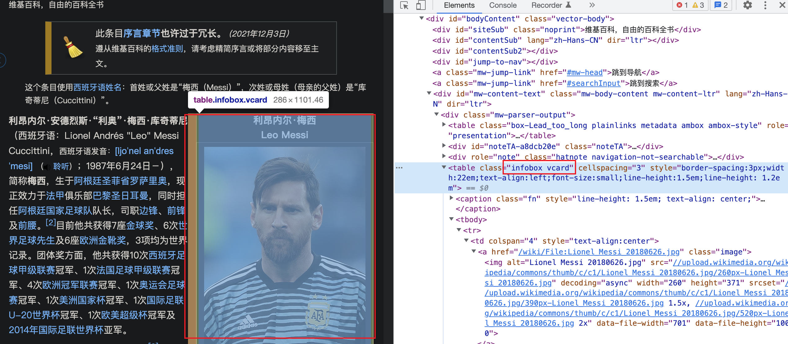
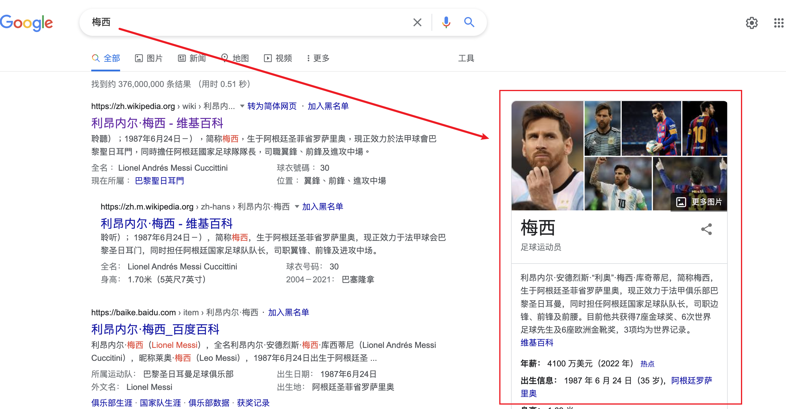

> 摘自《前端开发核心知识进阶》


# 什么是html语义化
根据结构化的内容选择合适的标签，合适的标签就是对内容表达的高度概括。

<!--more-->
# html语义化的好处
1. 有利于SEO
2. 开发维护体验更好
3. 用户体验更好（例如使用alt标签来解释图片信息）
4. 更好的可访问性，方便任何设备（如盲人阅读器）对代码进行解析

# 常用html标签总结
```js
if (导航) {
  return <nav />
}
else if (文稿内容、博客内容、评论内容......包含标题元素的内容) {
  return <article />
}
else if (目录抽象、边栏、广告、批注) {
  return <aside />
}
else if (含有附录、图片、代码、图形) {
  return <figure />
}
else if (含有多个标题或内容的区块) {
  return <section />
}
else if (含有段落、语法意义) {
  return <p /> || <address /> || <blockquote /> || <pre /> || ...
}
else {
  return <div />
}
```

# 高级玩法：微格式Microformats
MicroFormats 的原理就是通过扩展html元素或者属性，来增强html的语义表达能力。

## Microformats示例
例如维基百科页面中，有一部分结构被加上了vard的class。


google搜索引擎可以通过维基百科页面中的vcard这个class读取到相关内容，在呈现搜索结果时展现出与搜索结果相关的任务信息。语义化的class可以帮助机器学习（爬虫）更多信息，展现出更好的画面。

