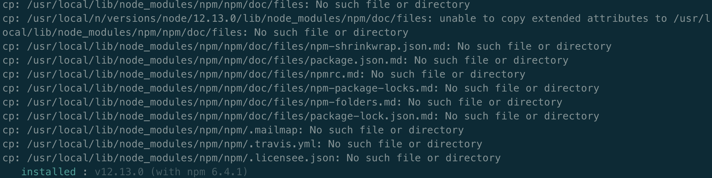
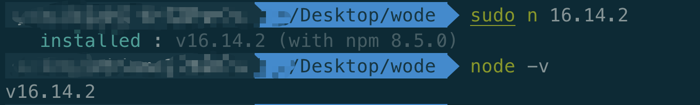

当我试图运行npx命令来创建一个react项目demo的时候

```bash
npx create-react-app my-app
```
命令行出现报错提醒：

```bash
npm ERR! cb.apply is not a function
```
<!--more-->
此次运行环境macOS，使用了node版本工具n

# bug解决办法
利用n进行node版本切换的时候，要使用管理员命令sudo，例如：
```bash
sudo n 16.14.2
```

# bug解决原理分析
因为最开始直接使用的n命令进行的node版本切换，之前也是一直这样使用，例如：
```bash
n 16.14.2
```

但是之前运行完此命令的时候，版本切换的结果中有很多warning提醒：


从报错结果可以看出，n工具是将原先的node版本和之前下载好的node版本两个文件夹之间进行替换，从而实现node版本切换

但是在直接使用n命令进行切换的话，会出现许多报错信息，进行分析可以发现有许多文件没有转移成功。

但是当我进行node版本查看的时候，发现已经切换成功

```bash
node -v
# v12.13.0
```
先前因为版本切换成功，并且相关node命令也好使，所以我对于node版本切换过程中的报错没有特别在意。

知道在运行文章开头的npx命令时发现致命报错。

针对此项报错，我进行了一番Google，发现大家的处理方法的原理基本上都是进行node重装。但是因为我的工作机中集成了许多配置，不想重新搞，所以放弃了这种做法

在浏览过程中发现有一篇文章，博主说自己运行n命令进行node版本切换的时候，一直切换不成功，只能使用sudo命令才行。

我也试了一下，果然发现了一些不一样的地方：



非常丝滑的切换，咩有任何报错提示，接着运行上面的npx命令也成功了。