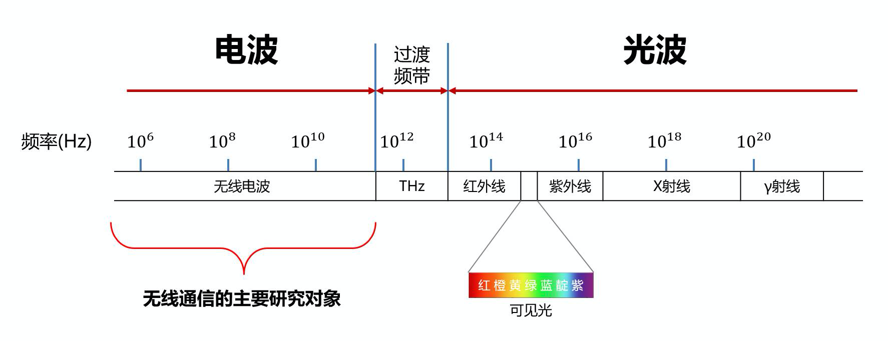

我对于无线通信技术一直很有兴趣，主要是来源于对于物联网领域的好奇。但是对于各种各样的无线通信技术，初学者直接看肯定头大，尤其是我本身还不是这个专业出身的。所以还是老老实实的学习基础吧。

<!--more-->

无线通讯技术的衡量标准，有四个重要参数，分别是：

1. 频段
2. 信道
3. 信道带宽
4. 传输速率

# 频段

无线通信依靠的是电磁波来传递信息，电磁波是以变化电场－变化磁场－变化电场－变化磁场...交替发生产生进行传播的，所以电磁波的频率是单位时间内完成周期性变化的次数，是描述周期运动频繁程度的量。频率的单位是Hz（赫兹），不过频率的数字都比较大，一般都用MHz（M是10^6）。

为了方便分类管理，我们会根据他们的频率不同划分不同的段。把频谱给切开：

上图展示了整个频谱的[频段分布](http://www.c-fol.net/baike/content/3/1712.html)，在这个频谱图中，Wi-Fi 的频段是 2.412GHz-2.484GHz。这是一个非授权频段，其他的通信技术也可以使用，所以在后面你会看到蓝牙技术也基本是这个频率范围。理解了这一点，也许你就能明白，为什么 Wi-Fi 路由器和蓝牙耳机、键鼠，在某些情况下会相互干扰了。

有没有什么办法能解决通信干扰呢？答案是肯定的，其中一种有效的方法是基于信道的跳频技术。

# 信道

信道是信息通过无线电波传送的具体通道介质。每种通信技术的频段会被划分、规划成多个信道来使用。

一般来说划分为无线信道、有线信道。有线信道就是通过导线这种进行信息传输的。无线信道就是电磁波，根据频段进行划分。

比如，Wi-Fi 的频段被分为 14 个信道（中国可用的是 13 个信道，信道 14 排除在外）。这里需要注意的是，相邻信道的频段是存在重叠的。比如，Wi-Fi 的信道 1 频段是 2.401GHz～2.423GHz，信道 2 频段是 2.406GHz～2.428GHz。

# 信道带宽

对于无线信道来说，信道频段最大值和最小值之差，就是信道覆盖的范围大小，也叫信道带宽。比如，Wi-Fi 信道 1 的带宽是 22MHz，它是由 2.423GHz 减去 2.401GHz 得到的。

需要注意的是，22MHz 是信道 1 的实际带宽，而它的有效带宽只有 20MHz，因为其中有 2MHz 是隔离频带。隔离频带主要是起保护作用的，就像高速公路上的隔离带。

# 传输速率

上高速公路的时候，我们会注意当前路段对车速的要求。而在选择通信技术的时候，传输速率就是我们需要关注的重要指标。它是指数据传输的快慢，单位是比特 / 秒（bit per second，简记为 bps）。

传输速率受很多因素的影响，比如信道带宽和频率。一般来说，带宽越大，传输速率就越大，就像路面越宽可以承载的通行车辆越多一样；频率比较高时，电磁环境相对比较干净、干扰少，传输速率会更高，就像道路更平坦自然可以通行更多车辆一样。

# 总结一下

