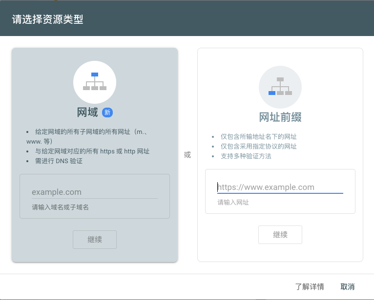

在自己的博客写了好久，确实一直纳闷为什么网站的访问量那么低。

google自己的文章也搜不到。自己google了一下，好家伙，原来是搜索引擎没有收录自己的站点。

另外因为网站会有一些敏感内容，我也不去百度凑热闹了。仅限google收录，不过两者基本流程其实差不多

博客站点利用hexo + github pages 搭建
<!--more-->
# 验证网站是否已被google收录

打开谷歌搜索，在搜索框中输入

site:https://jakemama.github.io/ ( 注意将冒号后面的网址替换为你自己的)

如果提示说：找不到和您查询的“site:https://jakemama.github.io/” 相符的内容或信息，说明未被收录。

如果搜索结果的第一条就是你的博客站点，说明已被收录，不用再继续看下面的内容了。

# 将网址提交到Google搜索

进入Google Web Master [Search Console](https://search.google.com/search-console)，登录之后提交你的博客网址：



将你的网址填入，我这里使用的是第二个网址前缀

之后进入验证界面，向google证明网址是你自己的。

建议选择html验证或者meta标签验证

选择html验证，将google提供的html文件放在你hexo项目的source文件夹里面。

选择meta标签验证，去你的theme文件夹中找负责首页渲染的那部分ejs模版，在其中加上google提供的meta标签。

修改完记得网站上线更新一下。

# 添加站点地图

站点地图(Site Map)是用来注明网站结构的文件，我们希望搜索引擎的爬虫了解我们的网站结构，以便于高效爬取内容，快速建立索引。

好在hexo有相关的site map生成插件

## 安装插件
首先为Hexo安装hexo-generator-sitemap和hexo-generator-baidu-sitemap插件，在Hexo博客目录下运行：

```
npm install hexo-generator-sitemap --save
```

## 修改配置文件
打开博客根目录下的_config.yml文件，添加如下字段:

```
sitemap:
  path: sitemap.xml
```

然后重新生成博客文件，运行

hexo clean

hexo g

此时应该可以在public目录下看到sitemap.xml文件了。

## 添加、测试站点地图
回到之前提交搜索资源的页面，在左边侧边栏找到“站点地图”,点击“添加/测试站点地图”，将https://xxxx.github.io/sitemap.xml 提交并刷新，就可以看到博客的网站结构了。
如果没有什么问题的话，到这里就结束了，但是现在用Google还不能立即查到博客的内容，要等到搜索引擎下一次更新检索时才会有显示。
