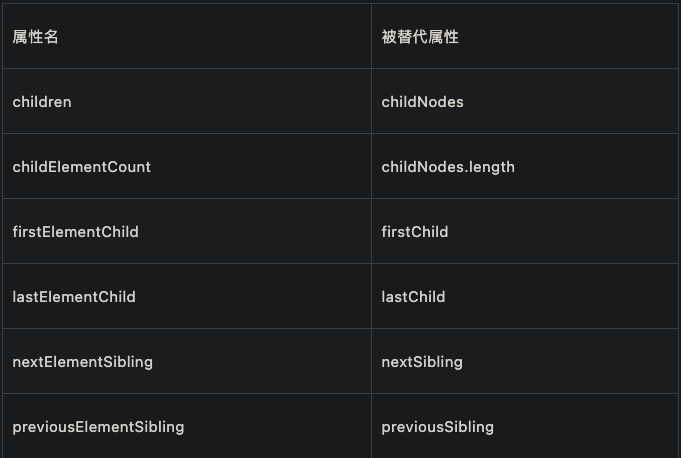

前端的性能优化的核心其实就是：**资源更快的加载速度、视图更快的渲染/交互速度**。

简单来说，主要是**网络层面**和**浏览器层面**的优化

<!--more-->
# 性能统计计算

## 单机测试
单台机器测试的时候，可以使用谷歌浏览器控制台提供的Performance和Lighthouse，Performance的信息非常详细，上手难度较高。Lighthouse信息简单，也全面，并且会有对应的优化提示。

## 一些常见的性能指标：
- 首次绘制（First Paint，FP）
  - 在渲染进程确认要渲染当前响应资源后，渲染进程会先创建一个空白页面，通常把创建空白页面的这个时间点称为 First Paint，简称 FP
  - 所谓的**白屏时间**其实指的就是创建这个空白页面到浏览器开始渲染非空白内容的时间，比如页面背景发生变化等
- 首次内容绘制（First Contentful Paint，FCP）
  - 当用户看见一些 "内容" 元素被绘制在页面上的时间点，和白屏是不一样，它可以是 文本 首次绘制，或 SVG 首次出现，或 Canvas 首次绘制等，即当页面中绘制了第一个 像素 时，这个时间点称为 First Content Paint，简称 FCP
- 首屏时间 / 最大内容绘制（Largest Contentful Paint, LCP）
  - LCP 是一种新的性能度量标准，LCP 侧重于用户体验的性能度量标准，与现有度量标准相比，更容易理解与推理，当首屏内容完全绘制完成时，这个时间点称为 Largest Content Paint，简称 LCP
  - 最大内容绘制应在 2.5s 内完成
- 首次输入延迟（First Input Delay, FID）
  - FID 测量的是当用户第一次在页面上交互的时候（点击链接、点击按钮 或 自定义基于 js 的事件），到浏览器实际开始处理这个事件的时间
  - 首次输入延迟应在 100ms 内完成
- 累积布局偏移（Cumulative Layout Shift, CLS)
  - CLS 是为了测量 视觉稳定性，以便提供良好的用户体验
  - 累积布局偏移应保持在 0.1 或更少
- 首字节达到时间（Time to First Byte，TTFB）
  - 指的是浏览器开始收到服务器响应数据的时间（后台处理时间 + 重定向时间），是反映服务端响应速度的重要指标
  - TTFB 时间如果超过 500ms，用户在打开网页的时就会感觉到明显的等待

## 自动化测试
当需要实现自动化测试的时候，可以使用performance Api，浏览器端的全局对象 window 上有一个名为 performance 的属性，它是一个用于支持 IE9 以上及 webkit 内核浏览器中用于记录页面 加载 和 解析 过程中关键时间点的机制

### window.performance
#### performance.timing
performance.timing 属性中提供了很多关键的时间信息，我们可以通过这些时间节点来简单的计算出需要的性能指标数据（不一定准确），计算方式如：
```js
const {
 domainLookupStart,
 domainLookupEnd,
 navigationStart,
 loadEventEnd,
 responseStart,
 responseEnd,
 connectStart,
 connectEnd,
 redirectStart,
 redirectEnd,
 domContentLoadedEventEnd,
 domComplete,
 fetchStart,
 unloadEventEnd,
 unloadEventStart,
 domInteractive,
 domLoading
} = performance.timing

// DNS 查询时间
DNS = domainLookupEnd - domainLookupStart

// DNS 缓存时间
AppcacheTime = domainLookupStart - fetchStart

// 卸载页面时间
unloadTime = unloadEventEnd - unloadEventStart

// TCP 建立连接时间
TCP = connectEnd - connectStart

// request请求耗时
reqTime = responseEnd - responseStart

// 页面重定向时间
Redirect = redirectEnd - redirectStart

// 首字节到底时间
TTFB = responseStart - navigationStart

// 首次渲染时间
FP = responseStart - navigationStart

// DOM 解析时间
DOM = domComplete - responseEnd

// 解析DOM树耗时
analysisTime = domComplete - domInteractive

// 首屏时间
LCP = loadEventEnd - navigationStart
// 用户等待页面完全可用时间
loadPage = loadEventEnd - navigationStart

// 白屏时间
blankTime = domLoading - fetchStart

// domReadyTime 即用户可交互时间
domReadyTime = domContentLoadedEventEnd - fetchStart


```

#### performance.getEntries()方法
performance.getEntries() 方法可以获取所有资源请求的时间数据，点击可查看具体的资源信息，其他属性和上述内容有重复，就不在额外介绍计算方式了

#### performance.now() 方法
performance.now() 方法可以精确计算程序执行时间，它会返回以微秒（百万分之一秒）为单位的时间，即更加精准，这也是它和 Date.now() 是不同点：

- Date.now() 返回自 1970年1月1日 00:00:00 (UTC) 到 当前时间 的 毫秒数
  - 意味着 Date.now() 依赖于系统的当前时间，而系统时间可以被认为修改，因此它的毫秒数并不准确
  - performance.now() 的时间是以恒定速率递增的，不受系统时间的影响

```js
// Date.now()
let a = 2, b = 3;
const begin = Date.now();
console.log(' a + b = ', a + b);

console.log('time = ', Date.now() - begin); // 2

// performance.now()
let a = 2, b = 3;
const begin = performance.now();
console.log(' a + b = ', a + b);

console.log('time = ', performance.now() - begin); // 0.10000002384185791
```

### Web Vitals
**`web-vitals`**[6] 库是 Google 推出的一个小型（约 1.5K）模块化库，用于测量真实用户的所有 Web Vitals 相关的指标

### 自定义测试收集
对于一些SPA应用，路由跳转并不会导致页面刷新，这时候window.performance可能就不太准确了，这时候我们可以手动来计算首屏渲染时间。

1. 使用计时器：计时器为0，不断检测img节点是否在首屏并加载完成，没有图片的话就监听DOMReady时间
2. 不用计时器：默认首屏加载时间主要由图片影响，纯文字加载是很快的。给所有img图片添加回调事件。


# 网络层面优化

## 使用 dns-prefetch 减少 DNS 的查询时间
dns-prefetch 能够 提前解析 后续可能会用到的 不同域的域名，使解析结果 缓存到系统缓存 中，缩短 DNS 解析时间以提高网站的访问速度。
```html
<link data-n-head="ssr" rel="dns-prefetch" href="//api.juejin.cn">
```

## 使用 preconnect 提前建立连接
preconnect 的作用是提前和第三方资源建立连接，设置了它浏览器就会做好早期的连接工作，但这个连接通常只会维持 10 s。

比如在当前域请求一个资源前，可能会涉及 DNS 寻址、TLS 握手、TCP 握手、重定向等，这过程也会花费一定的时间。
```html
<link data-n-head="ssr" rel="preconnect" href="//xxx.xxx.com" crossorigin="anonymous">
```

## 使用 preload / prefetch 预先加载资源
preload 的作用是提前加载页面对应的 关键资源 加快页面的渲染，preload 的优先级顺序和 as 属性相关

> as 属性一定要设置，除了上面提到的设置优先级外，还涉及到浏览识别的问题：如果没有设置 as 属性，后续遇到该请求就会被作为一个 XHR 请求，把意味着资源预加载的功能可能会失效，因为可能会每次都发起新的请求获取

```html
<link rel="preload" href="xxx/xxx/xx.js" as="script">
```

preload 是对资源的预加载，它虽提前加载但只在需要执行时执行，即这个资源一定是当前页面所需要的资源，如果是需要为下一个页面提前加载资源，那么应该使用 prefetch，它会在 浏览器空闲时 下载资源。

在vue-cli的默认webpack配置
```js
new PreloadPlugin(
  {
    rel: 'preload',
    include: 'initial'
    fileBlacklist: [
      /\.map$/,
      /hot-update\.js$/
    ]
  }
),

new PreloadPlugin(
  {
    rel: 'prefetch',
    include: 'asyncChunks'
  }
)
```

## 压缩资源体积
资源是需要通过 http 数据包的方式在网络中进行传输的，那么只要能减少传输数据包的体积，也是能够使得资源更快到达客户端，这也是压缩资源体积的核心目的。

本地使用的一些图片可以提前进行压缩处理

### HTTP压缩
HTTP 压缩中一个典型代表就是 gzip，它是一种优秀的压缩算法，压缩能将响应的数据量减少将近70%，因此可考虑对 http 请求中的一些文件资源，html,脚本，样式，图片进行压缩，一般来讲是要在服务端处理的，可通过在响应头中设置 Content-encoding: gzip 表示当前资源使用的压缩方式（如：gzip、deflate、br 等），便于客户端使用正确的方式解压。

> 【注意】gzip 并不是万能的，它不能保证针对每个文件的压缩都能使其体积变小


```bash
// 浏览器请求时对http header设置
Accept-Encoding: gzip
// Web服务器响应时对http header设置
Content-Encoding: gzip
```
### Webpack压缩
HTTP压缩本身是需要时间的，如果所有资源等到被访问时才被服务端压缩，那么在压缩完成前客户端就处于等待状态。所以可以将一些压缩资源的操作放在打包构建中。主要使用webpack插件来实现。

- 使用 CompressionPlugin 压缩文件
- 使用 HtmlWebpackPlugin 压缩 HTML 文件
- 使用 SplitChunksPlugin 自定义分包策略：Webpack 默认会将尽可能多的模块代码打包在一起，可以降低最终页面的HTTP请求数，但页面初始代码可能过大，影响首屏渲染性能，也无法有效应用浏览器缓存。可以通过动态import引入进行优化，虽然不能减少文件体积，但是通过Code Splitting（代码分割，vite有，不知道webpack有没有）告诉构建工具代码分割的分割点，减少初始代码体积，提高首屏渲染性能
- 使用 MiniCssExtractPlugin 抽离和压缩 CSS，使用vite-plugin-import插件对css资源进行按需引入
- 使用 ImageMinimizerWebpackPlugin 压缩图片资源
- 通过 Tree Shaking 移除无用代码，当 webpack 的模式 mode 为 "production" 时，就可以启用 更多优化项，包括 压缩代码 与 Tree Shaking。但同时必须保证
  - 尽量使用 ES6 模块语法，即 import 和 export
  - 保证没有 编译器（如：babel）将对应的 ES6 模块语法转换为 CommonJS 的语法（如：@babel/preset-env 的默认行为）
  - 可在项目的 package.json 文件中添加 "sideEffects" 属性，标识当前内容是否存在副作用操作
  - 可在通过 /*#__PURE__*/ 注释，将函数调用标记为无副作用[16]
  - Tree Shaking 只针对Js代码，对于css和资源类的无法移除

## 减少 http 请求数量
- 合并公共资源，如 雪碧图 等
- 内置模块资源，如 生成 base64 图片、通过 symbol 引用 svg 等
- 合并代码块，如构建工具分包策略配合 公共组件封装、组件复用逻辑抽离 等
- 按需加载资源，如 路由懒加载、图片懒加载、上拉加载、分页加载 等


## 将文件分配到不同的域名
把组件分散到不同的域名允许你最大化并行下载数。但要确保只用不超过2-4个域，因为存在DNS查找的代价。例如，可以把HTML和动态内容部署在www.example.org，而把静态组件分离到static1.example.org和static2.example.org。

## 减少不必要的 cookie
不必要的 cookie 来回传输会造成带宽浪费：

- 减少 cookie 存储的内容
- 对于静态资源采用 CDN 托管（即非同域），不同域名默认不携带 cookie

## CDN 托管静态资源 + HTTP 缓存
CDN 加速的本质是缓存加速，将服务器上存储的静资源容缓存在 CDN 节点上，当后续访问这些静态内容时，无需访问服务器源站，选择就近访问 CDN 节点即可，从而达到加速的效果，同时减轻服务器源站的压力

## 协议升级为 Http2.0
- 针对 **TCP 连接数** 被限制的问题，http2.0 采用 **多路复用** 一个域名只对应一个 TCP 连接
- 针对 **http 队头阻塞** 问题，http2.0 中通过二进制分帧层为每个 请求/响应 添加 stream id 保证 请求/响应 一一对应，即不必等待前面的请求处理完成，并且还可以为每个请求添加 优先级
- 针对 **header 数据大**的问题，http2.0 中传输的 header 帧经过处理后会用 二进制 的方式表示，替换了原本的 文本格式，并使用 HPACK 算法进行压缩
  - 接收/发送 两端会维护一个 **索引表**，通过下标来标识 header，针对后续重复的 header 信息就可以用对应的索引来代替
- 针对传统的 请求 —> 响应 模式，http2.0 中提供了 **服务端推送** 的能力，让服务端能够主动向客户端推送关键资源，加快资源加载


# 浏览器层面优化
浏览器渲染HTML的核心过程

- HTML 解释器：将 HTML 文档经过词法分析输出 DOM Tree
- CSS 解释器：解析 CSS 文档，生成样式规则 CSSOM
- 样式计算：将 DOM Tree 和 CSSOM 合并生成 Render Tree
- 布局计算：计算Render Tree在页面中的位置，创建Layout Tree
- 划分图层：为一些复杂效果（3D变换、页面滚动、z-index）生成专用图层，生成对应的图层树Layer Tree
- 图层绘制：将图层拆分成很多小的「绘制指令」，并按顺序组成「绘制列表」，之后由主线程提交给合成线程
- 栅格化 raster：合成线程将图层划分成图块，渲染进程 把 生成图块的指令 发送给 GPU 并执行生成图块的 位图
- 合成和显示：一旦所有图块都被光栅化，合成线程 就会生成一个绘制图块的命令 —— DrawQuad，然后将该命令提交给 浏览器进程。浏览器进程 里面有一个 viz 组件，会根据 DrawQuad 命令，将其页面内容绘制到内存中，最后再将内存显示在屏幕上

## 渲染层面

### 优化文档结构

- HTML 文档中首次渲染的节点数量要尽量少，避免深层次的嵌套结构，避免大量使用慢标签（如：iframe）等
- CSS 资源放文档头部，降低 CSS 复杂度，比如 合理使用 CSS 选择器
- js脚本文件在外部比在内部性能更好，因为可以缓存文件。
- **脚本阻塞问题.推荐将所有js文件放在body标签底部以减少对整个页面的影响。**，合理使用 defer、async 的加载方式
- **减少页面外链脚本文件的数量将会提高页面性能**：http请求会带来额外的开销，因此下载单个300k的文件将比下载10个30k的文件效率更高。
- **动态脚本加载技术**：无论何时启动下载，文件的下载和执行都不会阻塞页面其他进程。写个load函数，动态创建script标签。或者使用一些无阻塞加载类库——LABjs
- 图片和脚本进行预加载，利用link的preload和prefetch来预加载
  - preload 告诉浏览器立即加载资源;
  - prefetch 告诉浏览器在空闲时才开始加载资源；
  - preload、prefetch 仅仅是加载资源，并不会“执行”;
  - preload、prefetch 均能设置、命中缓存；
  - 正确使用 preload、prefetch 不会导致重复请求，重复preload和prefetch会重复请求，页面中使用到的资源时不会再请求；
- 尽量少用iframe
  - 优点：
    - 帮助解决缓慢的第三方内容的加载，如广告和标志；
    - 并行下载脚本；
    - 安全沙箱；
  - 缺点：
    - 即使空的也消耗（资源和时间）
    - 阻塞了页面的onload；
    - 非语义化（标签）


> 使用示例

```html
<link rel="prefetch" href="https:/xxx" as="image" />

<link rel="preload" href="/main.js?t=2000" as="script">

<link rel="prefetch" href="/prefetch.css?t=1000" as="style">
```

### 懒加载
- 图片资源：优先加载在可视区范围内的图片，可视区外的图片 **延后加载**，或者说当移入的可视区时再加载
- 列表数据：列表数据通常数据里量大，不可能一次渲染完所有数据，一般通过 **分页加载、上拉加载** 等方式分批次渲染

### 白屏优化
白屏是由于 SPA 应用需要等待 JavaScript 加载并执行完成后才会生成具体的页面结构内容导致的，即初始化模板中没有任何有意义需要被渲染的 HTML 结构：

- 添加 **白屏 loading**，可在模板中添加默认的 loading 效果，等到真正页面内容被渲染就可以替换 loading 内容
- 添加 **骨架屏**，和上述方案一致，在真正页面内容展示出来之前，先展示默认的视图内容，避免白屏

### 服务端渲染
客户端渲染（client-side rendering，CSR）：组件的代码会在浏览器中运行，然后向页面输出DOM元素

服务端渲染（server-side rendering，SSR） 可将相同组件在服务渲染成相应的 HTML 字符串，并发送给浏览器进行渲染，即客户端不需要等待所有的 JavaScript 都被下载并执行之后才显示，所以用户可以更快看到完整的渲染好的内容。

### 预渲染
SSR并不适用于所有页面，此时可以考虑预渲染方式
- 预渲染 是在打包构建过程中（离屏状态），针对对应的 routes 路由预先生成对应的页面内容
- 预渲染 需要和 打包构建工具（webpack、rollup 等） 进行配合，如 **`webpack`**，就可通过 **`prerender-spa-plugin`**来支持 预渲染

## 交互层面
### 减少回流/重排、重绘
重绘：页面中元素样式的改变并不影响它在文档流中的位置时（如：color、background-color、visibility 等），浏览器会将新样式赋予给元素并 重新绘制

回流：当 Render Tree 中部分或全部元素的 尺寸、结构、某些属性 发生改变时，浏览器 重新渲染 部分或全部文档

- 能用CSS解决的话，尽量不用js操作DOM
- 减少对 DOM 进行频繁操作，在一个对性能要求比较高的操作中更新一段HTML，推荐使用innerHTML，因为它在绝大多数浏览器中运行的都很快。
- 使经常变动的元素脱离文档流，如具有持续性的动画效果，会一直触发回流和重绘
- 避免访问或减少访问会导致浏览器 强制刷新队列 的属性，如：offsetTop、offsetLeft、offsetWidth等，**建议：将设置样式的操作和获取样式的操作分开：**
  - 【扩展】浏览器的渲染队列机制会通过 队列 将会触发 回流或重绘 的操作进行存储，等到一定的时间或一定的数量时再执行这些操作
- HTML集合优化：HTML集合包含了DOM节点引用的类数组对象，一直与文档保持连接，每次你需要最新的信息时，都会重复执行查询操作，哪怕只是获取集合里元素的个数。**建议使用局部变量保存访问。需要频繁访问操作的话，建议将HTML转换成数组形式使用**
- 最小化重绘和重排
  - 批量改变样式，将设置样式的操作放在一起
  - 批量修改DOM的优化方案
    - **如果是向文档中加入大量dom结构，建议使用createDocumentFragment()，然后一次性加入文档**
    - **如果是像某一dom进行大量操作，可以先将其脱离文档流，例如设置成display:none，然后进行操作，再把display属性改回来**
  - 慎用hover属性，大量hover会降低速度
  - 通过事件冒泡来实现时间委托，减少时间处理器的数量
  - 预先设定图片尺寸，避免图片资源加载完成后引发回流
  - 使用 will-change 开启 GPU 加速，will-change 指定的属性使得浏览器可在元素属性真正发生变化之前提前做好对应的优化
- 遍历DOM：
  - 使用只返回元素节点的API遍历DOM,因为这些API的执行效率比自己实现的效率更高：
  - 选择器API——querySelectorAll()：querySelectorAll()方法使用css选择器作为参数并返回一个NodeList——包含着匹配节点的类数组对象，该方法不会返回HTML集合，因此返回的节点不会对应实时文档结构，着也避免了HTML集合引起的性能问题。
  
### 防抖和节流
合理使用 防抖/节流 优化应用中的操作，比如 节流 可用于优化 滚动事件、模糊搜索等，**防抖** 可用于优化一些按钮点击操作等。

### Web Worker
JavaScript 是单线程的，如果存在需要大量计算的场景（如视频解码），UI 线程就会被阻塞，甚至浏览器直接卡死。

Web Worker 可以使脚本运行在新的线程中，它们独立于主线程，可以进行大量的计算活动，而不会影响主线程的 UI 渲染，但不能滥用 Web Worker 。

使用Web Worker：它引入了一个接口，能使代码运行且不占用浏览器UI线程的时间。一个Worker由如下部分组成：
  1. ① 一个navigator对象，包括appName,appVersion,user Agent和platform.
  2. ② 一个location对象，只读。
  3. ③ 一个self对象，指向全局worker对象
  4. ④ 一个importScripts()方法，用来加载worker所用到的外部js文件
  5. ⑤ 所有的ECMAScript对象。如object,Array,Date等
  6. ⑥ XMLHttpRequest构造器⑦ setTimeout()，setInterval()
  7. ⑧ 一个close()方法，它能立刻停止worker运行
  8. 应用场景：编码/解码大字符串、复杂数学运算（包括图像，视屏处理）、大数组排序


```js
// worker.js
var worker = new Worker('code.js');
// 接收信息
worker.onmessage = function(event){
    console.log(event.data);
}
// 发送数据
worker.postMessage('hello');

// code.js

// 导入其他计算代码
importScripts('a.js','b.js');

self.onmessage = function(event){
    self.postMessage('hello' + event.data);
}
```

### 虚拟列表
基于 上拉加载 列表的渲染，随着加载数据的增多，对应的 DOM 节点也会增多，达到某个限制页面一定会发生卡顿

虚拟列表 核心就是固定渲染的 DOM 数，通过动态切换数据内容实现视图的更新，并保证文档中真实 DOM 的数量不随着数据量增大而增大（其实和 table 分页很像，但它支持滚动）

### 大文件分片上传
大部分的项目总少不了文件上传功能，但对大文件的上传还是有必要进行优化，所谓的 断点续传、秒传 都要基于 分片上传 这个核心功能。

### Excel 导入/导出
有时候也是需要前端来进行优化处理的，比如导入时前端不发送文件只发送解析后的 JSON 数据，导出时不需要单独发送额外接口，直接使用当前展示数据实现导出等。

### Vue项目优化

- 减少响应式数据的生成，对于纯展示、又需要使用在 template 模板中使用的数据，可使用 Object.freeze() 进行冻结，避免被转为 不必要的响应式数据
- Vue 组件初始化是比较损耗性能的，使用 函数式组件 减少组件初始化的过程，适用于实现没有业务逻辑只展示内容的简单组件
- 合理使用 v-show 和 v-if、为 v-for 组件设定唯一 key（非 index）、v-for 和 v-if 不要一起使用等
- 使用 KeepAlive 复用组件，避免组件重复的创建、销毁带来的性能损耗
- 使用 () => import(xxx) 方式实现路由懒加载
- 使用 ESM 的方式封装自定义工具库等
- 针对第三方库做到按需引入
- 合理使用闭包，避免造成内存泄漏
- 及时清除组件中的副作用，比如 setTimeout、setInterval、addEventListener 等

### 数据存取与JS性能

- 数据存储共有4种方式：字面量，变量，数组项，对象成员。访问层级越深的属性越慢。
- 可以把需要多次使用的对象成员，数组元素，跨域变量保存在局部变量中来改善js性能
- 循环中减少属性查找和反转
- 使用duff装置来优化循环
- 通常情况下switch比if-else快，但不是最佳方案
- 在windows系统中定时器分辨率为15毫秒，因此设置小于15毫秒将会使IE锁定，延时的最小值建议为25ms.
- 用延时数组分割耗时任务：
