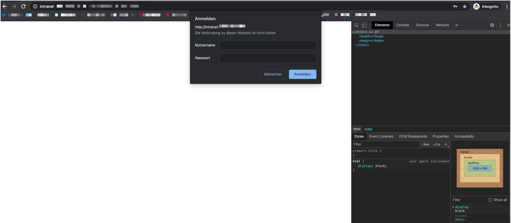

家里的路由网非常差，有次请了师傅来看，交了我如何[登陆路由器的管理员界面](2022-08_判断路由器报废标准.md)，经过我的观察，管理员页面可以控制路由器的重启，自己手动试了一下，重启之后网络确实表现的好一点，于是打算写个脚本来定时自动重启路由器，这样就不用操心了。

<!--more-->
技术就是用puppeteer + node，利用puppeteer自动启动一个浏览器来访问管理员页面，模拟点击重启按钮。

# puppeteer浏览器级账号密码输入
访问路由器管理员页面遇到的第一个问题，就是如何输入账号密码。就像下图这样。



通常我们使用puppeteer实现登陆功能的时候，登陆按钮一般都是DOM级的，意味着我们可以根据类名、元素标签或其他特性拿到目标元素，再想办法将账号密码填写进去

上图中的这种登陆界面，并不是DOM的一部分，他是属于chrome浏览器原生的登陆框。

幸运的是，puppeteer对于这两种情况都有解决办法。puppeteer提供`page.authenticate()` 方法来登陆原生登陆框。
```js
await page.authenticate({'username':'YOUR_BASIC_AUTH_USERNAME', 'password': 'YOUR_BASIC_AUTH_PASSWORD'});
```

# 选取目标元素点击
事实上，只要可以登陆，能够拿到对应的html结构，我们就可以根据puppeteer程序的dom选择和操作的api进行模拟点击了